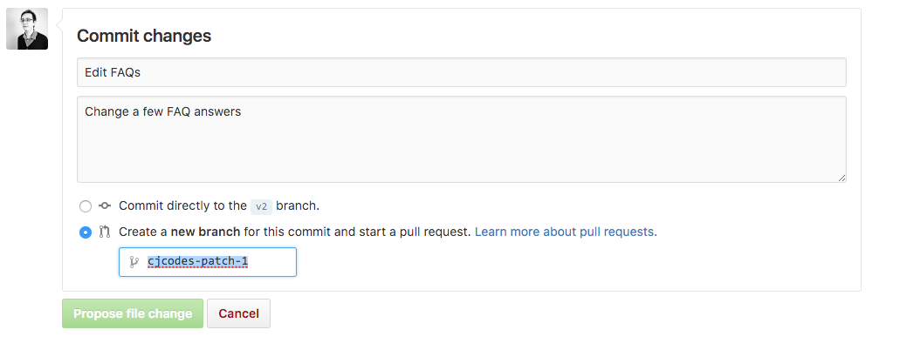

# Updating FAQs

Remember to code in escaped HTML. This means escaping \' apostrophes \' and using &lt;br&gt; instead of
pressing enter. There should be one question and answer per line.

## How to
1. Open the [faq.js](../app/faq.js) file
1. Click the pencil in the top right above the code
1. Submit the changes in a pull request (see below) Make sure you do NOT commit directly to the branch.



## Editing the file

### Adding a section:

```js
{
  'Section title': {
    'image': 'images/icon.png',
    'questions': {
    },
  },
}
```

### Adding a subsection:

```js
{
  'questions': {
    'Subsection title': {
      'question': 'answer',
    },
  },
}
```

### Adding a question directly

```js
{
  'questions': {
    'question': 'answer',
  },
}
```

### Subsections and questions can be mixed together

```js
{
  'questions': {
    'question': 'answer',
    'subsection': {
      'question': 'answer',
    },
  }
}
```
